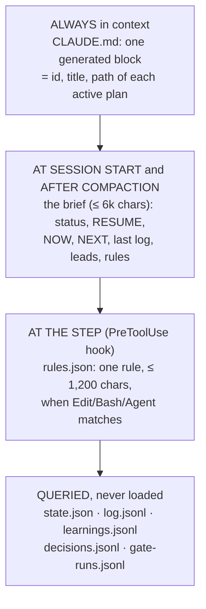

# Planning guide — plans that survive compaction

How to plan work that spans many sessions, and how to execute it without
losing accuracy when the chat is compacted or the session ends. The guide, the
CLI (`src/plan/plan.mjs`), the hooks (`src/hooks/`) and the `/plan`
skill are one system. This document is the reference for all four.

**Words used in this guide**

| word | meaning |
|---|---|
| **plan** | one directory of files that says what the work is, what proves it done, and where it stands |
| **planner** | whoever writes the plan (you, when `/plan` is invoked). The planner does not do the work. |
| **executor** | the later session that does the work. It sees only the plan's files, never the planner's chat. |
| **session** | one conversation with Claude Code. It ends, and its chat is gone. |
| **compaction** | Claude Code shrinking a long chat: your messages stay, every tool result is dropped |
| **hook** | a small script Claude Code runs by itself at a fixed moment: session start, before a tool call, at the end of a turn |
| **brief** | a short summary of a plan (≤ 6,000 characters) rendered from its files: status, what to do now, the last log entries, the rules |
| **gate** | a command that answers one question about the work with its exit code; "done" means the gate passed |
| **condition of done** | a statement that must hold before a task can be marked done; three are checked by the tool, the rest are answered in words |

**Entry points**

- *"Plan X"* or `/plan <raw plan>` → § Creating a plan.
- A session that starts with a plan active → the brief is injected for you;
  § Executing a plan says what to do with it.
- *"Close the plan"* → § Closing a plan.

## The three problems, and the idea

| problem | what used to happen | what the system does instead |
|---|---|---|
| **State is lost at compaction.** Compaction keeps your messages and drops every tool result. Doctrine survives; *what you already did* does not. | In the project this was built in, progress lived in a prose section rewritten from memory at the end of a session. It was stale three times in a week, each time saying "done" about work that was not. | Progress lives in append-only JSON written **as it happens** through a CLI. A `SessionStart` hook renders a brief from disk at every start and after every compaction. A `Stop` hook refuses to let a turn end with unlogged edits. |
| **Context bloat.** Every rule learned went into CLAUDE.md, because trimming it made the same mistakes come back. | That project's CLAUDE.md grew to 18,533 tokens plus a 9,232-token imported guide, both re-read on every call, and its two active plans were 135 KB and 257 KB: 34k and 64k tokens to open. | A rule is attached to the **step it applies to** and a `PreToolUse` hook injects it at that step (≤ 1,200 chars, once per session). The brief is ≤ 6,000 chars. Everything else is queried, not loaded. |
| **Instruments trusted as verdicts.** A script that succeeds is believed. | A `complete: true` flag shipped 31 times over data a third full, because the script answered a narrower question than its name. Four review passes each re-checked the same records because nobody recorded the checks. | A task is `done` only through `plan task done`, which **runs the gate and records the run**. Every gate states the question it *literally* answers and how it could pass while wrong. Every check made is recorded on the plan, so it is never made twice. |

The idea in one line: **put each fact in the cheapest place that still cannot
be forgotten.**



## The files of a plan

One directory per plan: `.project-management/plans/<id>/`. Each file has one
job and one writer.

| file | job | written by |
|---|---|---|
| `PLAN.md` | the stable narrative: why, done-means, non-goals, method, rules that cannot be automated, owner-approval points, map, sources | the planner, by hand; rarely changed |
| `state.json` | manifest (id, title, status, watched `paths`) and the tasks | the CLI, after creation |
| `gates.json` | what proves each task done: question, command, known-fail case, how it could lie | the planner, with `plan gate add` or by hand; validated |
| `rules.json` | rules a hook injects at the tool call they apply to | the planner, by hand (there is no `rule add`); validated |
| `log.jsonl` | progress: what landed, what is next, refs | `plan log` (append-only) |
| `learnings.jsonl` | what went wrong or surprised, the rule it teaches, how it is enforced | `plan learn` (append-only) |
| `decisions.jsonl` | what was chosen, why, what was rejected, by whom | `plan decide` (append-only) |
| `gate-runs.jsonl` | every gate execution: command, exit, tail, result | `plan gate run/verify`, `plan task done` (append-only) |

The shape of every record is declared once, in `src/plan/lib/schema.mjs`,
as strict objects: an unregistered key is refused. The validator
(`src/plan/lib/store.mjs`) runs inside `the project's check script`.

## The rules

1. **Status is derived, never typed.** The brief is rendered from the files
   every time. There is no "current status" paragraph to go stale. *Case:*
   the "Phase 1 is done" claim that was false three times.
2. **Done needs evidence.** `status: done` is valid only with a gate run the CLI
   recorded, or a manual check with a reason of 20+ characters and who gave it.
   The validator refuses anything else, whoever wrote the file.
3. **A gate names its question, and the question it is not.** `question` says
   what the command literally answers; `notTheSameAs` names the nearby question a
   reader will assume; `couldPassWhileWrongIf` is the honest proxy risk. *Case:*
   a coverage script answered "has every chapter been started?" and was read
   as "is the book complete?".
4. **A gate must have been seen to fail.** `knownFail` is a case that must fail.
   `plan gate verify` runs it and records the result. Until then the brief says
   `never verified`. *Case:* the first run of a new diff tool reported three
   kinds of error that were in the tool, not in the data.
5. **Every rule is attached to a trigger.** A rule that applies "always" goes
   in CLAUDE.md, and CLAUDE.md is full. A rule that applies *before editing a
   migration file* goes in `rules.json` with `when: { tool: "Edit|Write", path:
   "db/migrations/**" }` and arrives exactly then.
6. **Record as you go, through the CLI.** After each landed piece of work:
   `plan log`. After a surprise: `plan learn`. After a choice: `plan decide`.
   The Stop hook reminds you once if files under the plan's `paths` changed and
   nothing was logged. *Case:* four review passes re-read the same records.
7. **The RESUME line is written before you stop, not after you start.** The
   `--next` of the last log entry is what the next session reads first. Write it
   as an instruction a stranger can execute.
8. **A learning says how it is enforced.** `prose` (must be read), `rule`
   (injected by the hook), `gate` (machine-checked) or `docs` (written into a
   guide). Closing a plan lists the prose-only ones and asks whether each can be
   promoted. That is how a learnings guide is built one line at a time instead
   of in one 9,000-token sitting.
9. **A finding is a lead until a second reader confirms it.** `plan learn
   --lead` marks it; the brief lists leads separately. *Case:* on 2026-09-07 four
   subagent findings were each directionally right and numerically wrong.
10. **The owner decides irreversible things.** `PLAN.md § Owner decides` lists
    them; `plan close` and `plan abandon` require `--confirmed-by-owner`, which
    means you asked in chat and were told yes. The CLI cannot check that; the
    guide says it, and the log records who.
11. **CLAUDE.md gets one generated block and nothing else.** `plan activate`
    adds the plan's line; `plan close` removes it; `plan validate --all` fails if
    the block and the active plans disagree. Never hand-edit the block.
12. **Never delete.** Hard rule 11 applies to plans too: a wrong plan is
    `abandoned`, not removed; a stale file moves to `.planrails/trash/`.

## Creating a plan

Whoever writes the plan will not carry it out. The executing session reads
only the plan's files; it never sees the planner's chat. If a fact is not in
the files, it does not exist for the executor. So the planner produces files,
not engineering.

### 1. Read, then answer these before writing

Read the raw plan. Then check what already exists:

```bash
npx planrails list                       # is there already a plan for this?
npx planrails learnings --search <term>  # what earlier plans learned about this area
```

Answer these seven questions from the raw plan and the repo. **Ask the user only
the ones you cannot answer, in one message.** Record every answer in
`PLAN.md` or as a `plan decide` entry with `--by owner`.

1. What does *done* look like, stated so that a command can check it? (→ gates)
2. What must not change? (→ § Non-goals, and `paths` for what may)
3. Which steps are irreversible or outward-facing, and who approves them? (→ § Owner decides)
4. What already exists — files, plans, scripts, sources, earlier learnings?
5. Which steps need maximum thinking (judgement, adjudication, mass edits) and
   which are routine? (→ `effort` on each task)
6. What are the limits — parallel workflows, tokens, time?
7. Who uses the result, and what would make it useless to them? (→ § Why)

### 2. Research with subagents

Subagents return summaries; you write the summaries into `PLAN.md § Sources`
and `§ Map`. Cover: the `docs/*_GUIDE.md` files that govern the paths this plan
touches (find them in CLAUDE.md's pointer table); the nearest in-repo example;
the exact files to be changed; existing scripts that already answer part of a
gate's question; external docs only if a new library or API is involved.

### 3. Scaffold and write PLAN.md

```bash
npx planrails new <id> --title "…" --paths "features/x/**,docs/X_GUIDE.md"
```

`paths` are repo-relative globs where the work lands. The Stop hook watches
them. Fill each section of `PLAN.md` (the template's comments say what goes
where). Two sections matter most:

- **§ Method** — the recipe per kind of task, with real commands and one worked
  example with real numbers. This is what stops the third session rediscovering
  what the first one learned.
- **§ Rules for this plan** — only rules that cannot be a gate or a hook rule.
  Numbered. Each one: the rule in a sentence, then the case that taught it. The
  brief shows the first 14 lines.

### 4. Write the gates — one that cannot lie

This is the planning-system plan's own first gate, and it runs as written:

```bash
npx planrails gate add <id> \
  --question "does every refusal in the plan validator's selftest fire on its case, and does every valid case pass" \
  --not "whether the validator refuses every WRONG state a person could write — only the cases somebody imagined are tested" \
  --command "npx planrails selftest" \
  --wrong "the selftest and the validator were written by the same hand, so a refusal nobody thought of is not exercised" \
  --known-fail "PLAN_PROJECT_ROOT=node_modules/planrails/src/plan/fixtures/broken-root npx planrails validate --all --quiet" \
  --known-fail-why "the fixture's task T1 is done citing a gate run that never happened; validate must exit 1" --kind runtime
```

`kind`: `static` reads files · `runtime` executes code · `reality` observes the
live system · `report` informs. A `report` gate cannot be a task's gate: the
validator and `task done` refuse it, because a report never proves anything.
It can back a spike whose result goes into `plan learn`.

**Then prove each gate can fail.** `npx planrails gate verify <id> --all`
runs every known-fail command. You *want* those commands to fail: that shows
the gate can see a real problem. `gate verify` prints VERIFIED when the
known-fail command failed with the expected exit code (`expectExit`, 1 by
default for `gate add`), and NOT VERIFIED when it passed, or exited with some
other code (a missing file or a usage error is not the failure the gate is
for). If it is NOT VERIFIED, fix the gate, not the case.

Reuse the project's own gates where they exist: its check script, its test
runner on one file (`npx vitest run <file>`, `pytest tests/x.py`), its end-to-end
suite, a script that hits the route. Ask of each one "how could this pass while
the work is wrong?" and write the answer into `couldPassWhileWrongIf`.

**Gates come before the tasks that name them.** `task add --gate G2` is
refused while G2 is undefined, because every write is validated. The order is:
gates, then tasks, then learnings, then rules that cite learnings. The
planning-system plan lost a task to each of the two wrong orders on 2026-09-12.

### 5. Write the tasks

A task is one session of work or less, and names what proves it done:

```bash
npx planrails task add <id> --title "waitlist join awards XP: manifest rule + actorId + tests" \
  --gate G2 --files "features/waitlist/feature.ts,tests/waitlist.test.ts" --effort high --after T1
npx planrails task add <id> --title "owner reads the new guide" \
  --manual "the owner opens docs/X_GUIDE.md and says in chat that it reads well"
```

"Implement backend" is not a task. A task with no gate must say in
`--manual` who checks it and how; it is closed later with
`task done <id> T6 --manual "<what was checked and how, 20+ chars>" --by owner`.
Add a task-specific condition of done with `--done-when "the row count
matches the source export, not the cache"` (repeatable); the plan's own conditions
(C1–C7, see § Marking a task done) apply to every task without being named. Always include a task for the docs that
ship with the change (CLAUDE.md rule 9); `activate` warns if none does. Add a
spike task ("read X, confirm Y is feasible") when a later task depends on
something unknown — its gate is `report` kind, its result goes in `plan learn`.

### 6. Write the rules — what goes where

| the rule applies… | put it in | how it reaches the executor |
|---|---|---|
| at one tool call (editing a file kind, running a script, spawning an agent) | `rules.json` | the PreToolUse hook injects it at that call, once per session |
| to a judgement no trigger can catch (how to weigh witnesses) | `PLAN.md § Rules for this plan` | the brief, at every session start |
| to every session of every plan, forever | CLAUDE.md — and think twice | always loaded; this is the expensive place |
| as a check a machine can make | a gate | it cannot be forgotten |

A `rules.json` entry:

```json
{ "id": "R1",
  "when": { "tool": "Edit|Write", "path": "db/migrations/**" },
  "text": "A migration is generated, never hand-written: run `npm run db:generate` after the schema change, and restart the dev server afterwards, or the old process keeps the old schema.",
  "repeat": "once", "why": "two hand-written migrations drifted from the schema in one week", "learning": "L2" }
```

`when.tool` is a regex over tool names; `path` is a glob (Edit, Write, Read,
NotebookEdit); `command` a regex (Bash); `prompt` a regex (Agent, Workflow).
`repeat`: `once` per session and per agent (the default; reset after compaction), `always`, or `every:N`.
Globs here let `**` cross dot-directories (`**/ch*.json` matches
`.cache/build/x/ch01.json`), unlike a shell.
Keep `text` under 1,200 characters; longer rules go in a file next to the plan
(`"file": "rules/R1.md"`) and should still be short.

**Order matters when a rule cites a learning.** Record the learning first
(`plan learn … `), then put its id in the rule's `learning` field. The
validator refuses a rule that cites a learning that does not exist yet, and
because every write is validated, *every later write to the plan fails until
the reference resolves*. The planning-system plan lost its first task this way
on 2026-09-12: `rules.json` cited L1 and L4 before either existed, so the
first `task add` was refused and the numbering of every task after it shifted.
Leave `"learning": null` until the learning is recorded.

### 7. Validate, verify, activate

```bash
npx planrails validate <id>           # schema + every cross-reference; errors block
npx planrails gate verify <id> --all  # every knownFail case must fail
npx planrails activate <id>           # adds the CLAUDE.md line, prints the brief
```

End your reply with the brief and one line saying what changed in CLAUDE.md.
Activation is reversible (`plan pause`), so it does not need permission;
closing does.

## Executing a plan

### Session start

The SessionStart hook injects each active plan's brief (`npx planrails
brief` prints the same thing). Read it in order: **RESUME** (the exact next
action), **NOW** (the task in flight and its gate's last result), **BLOCKED**,
**LEADS**, **RULES**. Then:

1. `git status` and `git log --oneline -5`. The repo outranks the brief: if
   RESUME says a file was written and it is not there, log the correction first.
2. If this is your first task on this plan this session, read `PLAN.md § Method`
   and `§ Rules for this plan` in full. The brief shows only the first 14 lines
   of the rules.
3. After a compaction, also read `.planrails/journal/<sessionId>.md` — the
   PreCompact hook wrote what this session already did (files, gates, commands),
   and the PostCompact hook tells you the path.

### The task loop

```bash
npx planrails task start <id> T3          # write-ahead: the brief now says NOW T3
# … work. Rules for the steps you take arrive from the hook. …
npx planrails log <id> --task T3 --what "digest job enqueues one email per subscriber (12 in the seed) → lib/jobs/digest.ts" --next "wire the Monday schedule in lib/jobs/schedule.ts, then task done T3"
npx planrails learn <id> --task T3 --what "the job runner retries a failed send 3 times with the same idempotency key, so a flaky SMTP sends nothing twice" --rule "always pass an idempotency key to enqueue()" --when "adding any job that sends" [--lead]
npx planrails decide <id> --task T3 --what "send the digest at 07:00 in the subscriber's timezone" --why "opens are 3× higher before 09:00 in the newsletter's own stats" --rejected "one global time: wrong for half the list" --by owner
npx planrails task check <id> T3          # every condition of done, with the automatic ones already evaluated
npx planrails task done <id> T3 --answer "C4: docs/JOBS_GUIDE.md § Digest updated in this change" --answer "C5: the 12 in the log was re-derived from the seed file" --answer "C6: L2 and D1 recorded" --answer "C7: read digest.ts and schedule.ts whole; the gate cannot see a wrong timezone, I checked the offset math by hand"   # runs G3; refuses if anything fails
```

The order matters: log first, then close. `task done` checks that a log
entry for the task exists (condition C2) before it runs the gate.

- **Log after every landed piece of work**, not at the end. "Landed" means: a
  number a gate reports moved, what is left changed, or a finding someone must
  re-check appeared. The Stop hook enforces the minimum: it blocks a turn's end
  once when edits under `paths` are newer than the last log entry.
- **`--next` is the RESUME line.** Write it for a stranger: the command, the
  file, the state ("half-done: schema written, migration NOT generated because
  the dev server was up — stop dev, `npm run db:generate`, restart, then T3's
  tests").
- **Subagent reports die with the session.** Put the path of the saved report
  (a file under the plan directory's `reports/`) in `--refs`.
- **A gate that fails is information, not an obstacle.** Log where it stands
  and why, fix the cause, run again. Never widen the gate.
- **Commit at task boundaries** and put the sha in `--refs`.

**Never hand-edit `state.json`, `gates.json` or a `.jsonl` file.** The CLI is the one
writer. If a command crashes or refuses and you cannot see why, log what happened and block
the task with `--needs owner`; do not repair the file by hand. In the black-box trial on
2026-09-12 a session met a crash on an older `state.json` and back-filled the missing keys
itself. It happened to write the right thing; the next one might not. The CLI now loads
older files with defaults, so the crash is gone, and the rule stands.

### Marking a task done

"Done" is a process, not a word. Every task carries conditions of done: the
plan's six (set when the plan is created, editable in `state.json`), plus any
the planner added to the task with `--done-when`. `task check` shows them;
`task done` refuses until all hold; `review` shows what was answered.

| id | condition | how it is settled |
|---|---|---|
| C1 | the gate ran in this very command and passed (or the owner's reason) | by the tool |
| C2 | a log entry names this task, written after it started | by the tool |
| C3 | every file the task lists exists on disk | by the tool |
| C4 | the docs for this change shipped with it — name them, or say why none | `--answer "C4: …"` |
| C5 | every number in the log and any report has a locator, or was re-derived | `--answer "C5: …"` |
| C6 | what was learned or decided is recorded — name the ids, or say nothing was | `--answer "C6: …"` |
| C7 | you read the changed files whole, against the task's purpose and the app, and judged the result right yourself — what you read, what you looked for, what the gate could not see | `--answer "C7: …"` |
| C8+ | the task's own conditions, and any the planner adds to the plan later | `--answer "C8: …"` |

C7 is the judgment condition. A green gate proves only what the gate checks;
C7 asks the person or agent closing the task to read the result as a whole and
say so in words. "Looks fine" does not pass. "Read greet.mjs and test.mjs whole;
looked for an argv with spaces, which the gate never tries; it prints the name
unquoted, and that is fine for a greeting" does.

**The plan's conditions can change while the plan runs.** `plan condition list <id>`
shows them. `plan condition add <id> --statement "…"` adds one; it gets the next
free id and records when it arrived, so a task closed earlier is not held to it.
`plan condition drop <id> C9` removes one the planner added. The three the tool
checks (C1–C3) cannot be dropped.

An answer is at least 10 characters and says what was checked, not "yes".
The answers are stored on the task next to the gate run, so a reviewer runs:

```bash
npx planrails review <id>        # every done task: its evidence and each condition with its answer
npx planrails review <id> T3     # one task
```

The validator ties the evidence to the work, not just to the gate: the cited
run must exist, must have passed, must carry the same timestamp as the
evidence, must postdate the task's start, and may prove one task only. A
gated task closed by hand is accepted only from the owner
(`--manual "…" --by owner --confirmed-by-owner`), never from the agent.
A task closed before its plan had conditions shows `checklist: NONE` in
`review` and a warning in `validate`; it is not silently promoted.

### Judgment outranks the gate

A gate is a script. It cannot read, cannot see, and answers only the one
question it was written for. Every gate here has cases where it is wrong, in
both directions, and so does every gate anywhere. So at every moment an agent
decides whether work is done (`task check`, the `task done` refusal, the brief,
the fresh-session prompt) it sees the same three lines:

- **Gate red, work right.** Never make the gate pass. Write down what it
  literally computed and what is true. If the gate is wrong, fix the gate and
  run `gate verify` again; its known-fail case must still fail. Otherwise
  `task block <id> T --reason "…" --needs owner` and stop. The owner's word
  closes it (`task done … --manual "…" --by owner --confirmed-by-owner`); the
  agent's does not.
- **Gate green, work wrong.** Refuse to close. Say what the gate cannot see, and
  fix the work. C7 exists for this.
- **Anything crashed.** Never edit a plan file by hand. Log it, block, stop.

Why the agent gets no "force pass with a reason" of its own: the agent's reason
is the least reliable signal in the system. In the project this system was built in, agents' claims
about their own evidence were wrong about one time in four, always in their
own favour, and "Phase 1 is done" was asserted in prose three times and false
each time. An override that lives with the agent becomes the path of least
resistance under pressure. Routing it through the owner keeps the agent's
judgment (it can say "this gate is wrong, here is why") without making it
judge and party at once.

Two rails back the words. A gate whose command changed after it was last
verified cannot close a task until `gate verify` runs again, and `validate`
fails on it; so a gate edited to pass must still fail its known-fail case. And
a gate that declares a known-fail case but was never verified cannot close a
task at all. What no rail prevents: an agent can still edit the code under
test, or a fixture. The append-only log and `plan review` make that visible;
the owner's reading of them is the last line.

### Blocked and paused

`plan task block <id> T3 --reason "…" --needs owner|external|self` puts the
reason in the brief. Switch to another task if one is independent. `plan pause
<id>` takes a whole plan out of CLAUDE.md without closing it.

## Closing a plan

```bash
npx planrails close <id>                       # runs EVERY gate fresh; lists prose-only learnings
npx planrails close <id> --confirmed-by-owner  # after the owner said yes in chat
```

A plan closes on what its gates say now, not on their last recorded run. Before
closing, look at each prose-only learning and ask: can it be a gate here? a
`rules.json` rule in the next plan that touches this area? a line in the guide
that governs this area (docs ship with the change)? Promote what can be
promoted (`plan learn … --enforcement gate --ref G4`, or edit the learning's
line) and leave the rest as prose with a clear `appliesWhen`. Closed plans stay
on disk; their learnings stay searchable with `plan learnings --search`.

## Hooks

Eight hooks, committed in `src/hooks/`; installed into this machine's gitignored
`.claude/settings.json` by `npm run hooks:install`; checked by
`npm run plan:doctor`; tested by `npm run hooks:selftest` against payloads
captured from a real run. Measured on Claude Code 2.1.269 on 2026-09-12:
SessionStart and PreToolUse `additionalContext` reach the model; a Stop hook's
`decision: block` makes the model continue with the reason, and the retry
carries `stop_hook_active: true`.

| hook | event | does | cost |
|---|---|---|---|
| `plan-session-start.mjs` | SessionStart | injects every active brief; records the session id; on `compact` resets once-per-session rules | one brief per active plan, ≤ 6k chars |
| `plan-pre-tool.mjs` | PreToolUse | injects matching `rules.json` rules; records edits under `paths` | ~40 ms per tool call; a rule ≤ 1,200 chars, once |
| `plan-subagent-start.mjs` | SubagentStart | puts the subagent note (report path, never delete, never close a task) in front of every subagent — measured to reach the subagent only | < 700 chars, once per agent |
| `plan-stop.mjs` | Stop | blocks once when edits are newer than the last log | only when it fires |
| `guard-never-delete.sh` | PreToolUse(Bash) | optional (`init --with-never-delete`): no delete commands, move aside instead (needs `jq`) | ~8 ms |
| `precompact-journal.mjs` | PreCompact | writes `.planrails/journal/<sid>.md`: files edited, gates run, images read | — |
| `postcompact-journal.mjs` | PostCompact | hands the journal path back | — |

Hook state lives in `.planrails/hooks/<sessionId>/` (`injected.json`,
`edits.jsonl`, `reminded.json`, `starts.jsonl`). `starts.jsonl` shows when the
SessionStart hook fired and with which `source` — the way to confirm it ran
after a compaction.

Two limits, stated plainly. The Stop hook sees edits made through Edit/Write
tools, not through a Bash `sed` or a script; log those yourself. And
`current-session.json` holds the *last* session that started, so a log entry's
`session` stamp can name a sibling session when two run at once — it is
informational.

## The CLI

`npm run plan -- <command>` or `npx planrails <command>`.

| command | does |
|---|---|
| `new <id> --title … [--paths a,b]` | scaffold a draft plan |
| `list` · `brief [id]` · `status <id>` | what exists · the injected brief · everything, with warnings |
| `agent-brief <id> <T> [--what …] [--label …]` | what a subagent gets instead of the plan (§ Workstreams and subagents) |
| `validate [id\|--all] [--quiet]` | schema, cross-references, done-needs-evidence, CLAUDE.md drift (inside `the project's check script`) |
| `task add\|check\|start\|done\|block\|unblock\|drop <id> [T]` | the task lifecycle; `add … --done-when "…"` adds a condition; `check` shows the conditions; `done … --answer "C4: …"` runs the gate and needs every condition; `drop … --reason` |
| `review <id> [T]` | every done task with its evidence and answered conditions |
| `condition list\|add\|drop <id> [--statement "…"] [C]` | the plan-level conditions of done; `add` records when, so earlier tasks are exempt |
| `run <id> [--max-tasks N] [--model m] [--dry-run]` | one fresh `claude -p` session per task (§ Fresh context per task) |
| `log` · `learn` · `decide` | the three append-only records |
| `gate list\|run\|verify\|add <id> [G\|--all]` | run a gate; prove it can fail; add one |
| `activate` · `pause` · `close` · `abandon --reason` | plan lifecycle; the last two need `--confirmed-by-owner` |
| `learnings --search <term> [--plan id]` | every learning, across plans |
| `hooks install\|status\|selftest` · `doctor` | the machine side |
| `selftest` · `schema --write` | prove the validator can fail; export JSON Schema files |

## Adopting an existing prose plan

A prose plan you already have keeps working the old way until it is adopted.
To adopt one: `plan new` with the same intent; copy its Mission/Why and the still-true
parts of its method into `PLAN.md`; turn its open task rows into `task add` calls
with gates (the project's own scripts are the gates); turn its Gotchas into `plan learn`
entries and its Decisions into `plan decide --by owner`; put its route-level
warnings that apply at a tool call into `rules.json`; activate; then replace the
old file's pointer in CLAUDE.md with a line saying it was adopted into
`plans/<id>/`. Do not delete the old file.

## Workstreams and subagents

A subagent is a fresh context that sees CLAUDE.md, its prompt, and whatever
hooks inject. It does not see the chat, the brief, or PLAN.md. Two measured
facts shape everything below (CLAUDE.md § TOKEN DISCIPLINE): the fixed prompt
is re-sent on every turn, so what you hand an agent is paid for again on each
step it takes; and an agent's own context grows with every unit it holds, so
cost per unit is quadratic in batch size (790,822 tokens per page at 16 pages
per agent; 306,426 at 1).

**What an agent gets: its slice, not the plan.**

```bash
npx planrails agent-brief <id> T7 --what "read leaf 12 of manasagari-1904" --label leaf-12
```

prints the brief to paste into the Agent prompt (≤ 3,000 chars): the unit to
do, the files it may write, what "done" means and who checks it, where to write
its report, the do-nots, then the plan's rules for those files, clipped. The
contract comes first so a long rule can never push it off the end. Two hooks
add the rest without anyone remembering: `plan-subagent-start.mjs` puts a
short note in front of every subagent (report path, never delete, never close
a task — measured to reach the subagent only), and `plan-pre-tool.mjs`
injects the matching `rules.json` rule when the agent touches a file, once
per agent (subagents share the parent's session id, so the dedupe is keyed by
`agent_id`).

**The rules, each with its case.**

1. **One writer per file.** Two agents that can write the same file will, and
   one will win. Give each task disjoint `files`; the validator warns when two
   tasks in flight list the same file. *Case:* an agent transcribing leaves
   99–112 overwrote every other leaf's `layoutRule` in that directory
   (2026-09-05); `page_0060.json` still carries the banner.
2. **Small units, passed in.** 1–2 units per agent; derive the shared rule
   (layout, format, convention) once and pass it in the brief (~500 tokens)
   rather than letting each agent rediscover it from a dozen pages in view.
3. **The report is a file, the reply is a pointer.** An agent writes
   `plans/<id>/reports/<T>-<label>.md`; its reply is ≤ 10 lines naming that
   file; the main session's `plan log --refs` names it too. *Case:* a reviewer
   who rejected a printed number by measuring the glyph against a known one on
   the same page: that measurement fits nowhere on a data record, and without
   the report the next reviewer repeats the work.
4. **An agent's finding is a lead.** Record it with `plan learn --lead`; the
   main session or a second reader confirms it before anyone acts on it. A
   number without a locator is dropped, not recorded. *Case:* on 2026-09-07
   four spot-checked agent findings were each directionally right and
   numerically wrong (4 → 1, 4,934 → 4,553).
5. **Only the main session closes tasks.** An agent never runs `plan task
   done` or `plan close`; it cannot see the whole plan and the gate is the
   main session's to run. Agents may write under their files and their
   report; the Stop hook counts their edits as unlogged work for the main
   session, which is what you want.
6. **Resumable by construction.** An agent skips any unit whose output already
   exists and parses, and says so in its report. Session limits kill workflows
   mid-flight; this has saved several runs.
7. **Sizing that was measured.** 8–10 agents per workflow (a workflow runs
   about 9 at once whatever you ask for), 1–2 units per agent, and **at most
   1–2 workflows at once** on this machine (three parallel reads hit the
   session limit and starved other projects). Effort per agent: `max` for
   judgement, `xhigh` for routine.
8. **Fresh over fork.** A forked agent inherits the whole conversation and
   pays for it on every turn; use it only when the agent truly needs the
   chat. Default: a fresh agent with the agent brief.
9. **Never optimise the reading; always shrink the carrier.** Cost tracks how
   hard the unit is inside the 0.1% the model writes; the 99.8% is the prompt
   and the accumulated context being re-sent. Cut the second, never the first.
10. **Bulk, uniform work is not an agent job at all.** One plain API call per
    unit (an image to transcribe, a record to classify) was measured at 465×
    cheaper than an agent doing the same, at equal or better accuracy; the
    agent's work is the judgement on the result afterwards.

**Parallel workstreams in one plan.** A workstream is a set of tasks whose
`files` are disjoint from every other stream's. Mark each task's stream in its
title (`[stream A] …`), give them disjoint `files`, start them with `plan
task start` (several may be `doing` at once), and hand each one to its own
agent or workflow with its agent brief. The main session merges: it reads the
reports, runs each task's gate with `plan task done`, logs once per landed
task. Where two streams must touch the same file, that file gets its own task
that both depend on (`--after`), so it is written once.

## Installing planrails in a project

```bash
npx planrails init                      # a new directory or an existing project; idempotent
npx planrails init --with-never-delete  # also block rm/rmdir/unlink/shred in Bash (needs jq)
npx planrails doctor                    # must say healthy
```

`init` installs planrails as a devDependency, copies this guide to
`docs/PLANNING_GUIDE.md`, creates `.project-management/plans/`, adds a
"Project management" section and the generated plans block to CLAUDE.md, adds
the npm scripts `plan`, `plan:doctor`, `plan:brief` and `plan:validate` (and
appends the validator to an existing `check` script), ignores `.planrails/`, and
writes the hooks into `.claude/settings.json` next to whatever hooks were
already there. The hook commands use `$CLAUDE_PROJECT_DIR`, which Claude Code
sets for every hook, so the settings file can be committed and works on every
teammate's machine after `npm install`. Run `npx planrails update` after
upgrading the package; `npx planrails uninstall` removes the hooks and the skill
and leaves the plans alone.

**Plan files written by an older version keep loading.** A `state.json` that
predates the conditions of done gets the default conditions when it is read,
and its tasks get empty checklists; the next write stores them. `validate`
warns about tasks that were closed before conditions existed, and `review`
shows `checklist: NONE` for them. No migration is needed.

## Fresh context per task

Claude Code cannot wipe its own memory between tasks: nothing the model, a
hook or a skill can do runs `/compact` or `/clear` (checked against the
documentation on 2026-09-12; decision D6 of the planning-system plan). The
nearest thing exists and is better: **a new session for every task.**

```bash
npx planrails run <id> --max-tasks 3          # three tasks, three fresh sessions
npx planrails run <id> --dry-run              # print the prompt the next session would get
```

`run` starts one `claude -p` session per task from the project root. The
session starts empty, the SessionStart hook hands it the brief, it does one
task, logs, answers the conditions, closes the task with `task done`, and
exits. The driver then reads `state.json`, never the session's words: done →
next task; blocked → stop and say why; not done → one retry with the RESUME
line, then stop. A task with no gate is a person's to close, so the driver
stops there. Sessions run unattended (`--dangerously-skip-permissions`); the
project's hooks still apply inside them. Auto-compaction stays on as the safety
net for a long task, and the PreCompact journal plus the SessionStart
re-injection make a compaction survivable when it happens mid-task. The
black-box trial (`scripts/trial/run.mjs`) is this pattern with snapshots
between sessions.

## Worked example: this system's own plan

`.project-management/plans/planning-system/` tracks the build of the planning
system with the planning system. Open it to see a real `PLAN.md`, gates with
known-fail cases (one runs the validator against a deliberately broken plan in
`node_modules/planrails/src/plan/fixtures/`, one runs a real `claude -p` session and checks the
brief reached the model), tasks closed by recorded gate runs, and learnings
recorded while building it.
